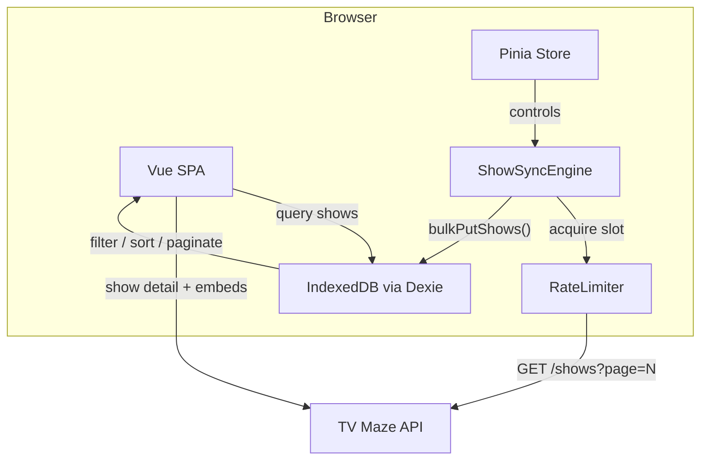
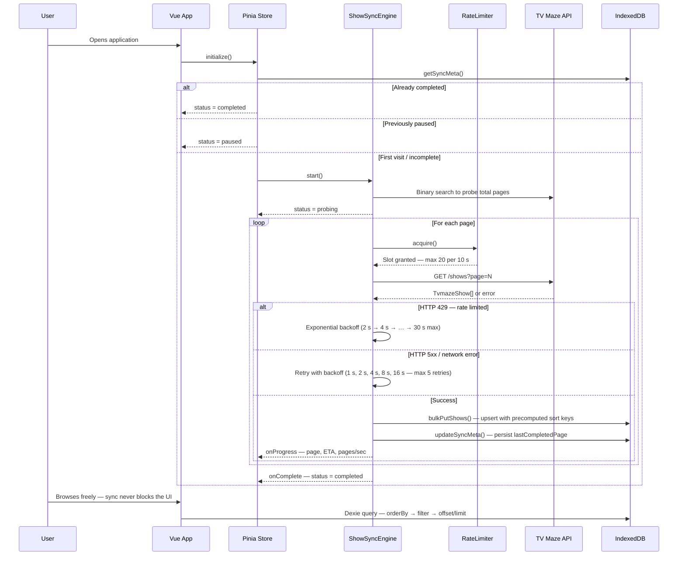
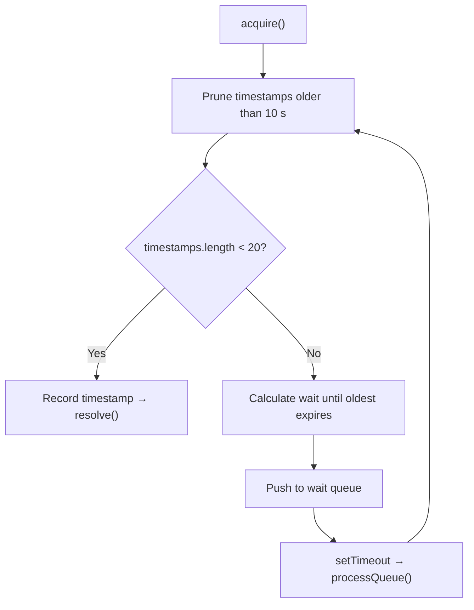
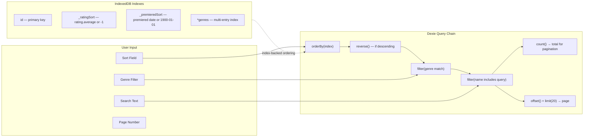
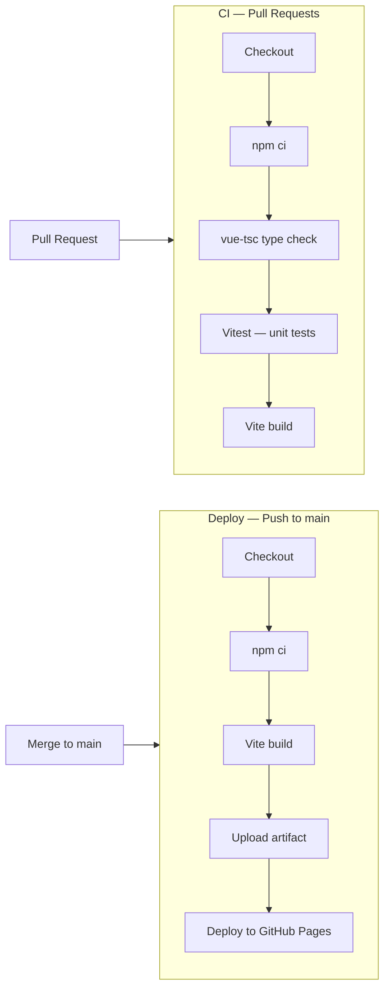

# TV Maze Explorer

A client-side TV show explorer built with Vue 3 that syncs the entire [TV Maze](https://www.tvmaze.com/api) catalogue into the browser's IndexedDB in the background, enabling instant genre browsing, full-text search, and rating-based sorting — all without a backend.

> **[Live Demo (GitHub Pages)](https://peimanfarajnezhad.github.io/tv-maze-explorer/)**

**Demo video:**

[demo-720.webm](https://github.com/user-attachments/assets/c632473a-8e1c-4548-ab14-94dfb3ea2dbe)

## The Challenge

Build a TV Maze explorer application that:

- Categorizes TV shows by genre
- Supports search
- Allows sorting by rating

**Key constraints:** the TV Maze API exposes no sorting or filtering endpoints and enforces a rate limit of 20 requests per 10 seconds.

## Solution Overview

This challenge can be solved in several ways. Three approaches were evaluated:

| #   | Approach                                                                                                                                                                                       | Trade-off                                                                                                                                       |
| --- | ---------------------------------------------------------------------------------------------------------------------------------------------------------------------------------------------- | ----------------------------------------------------------------------------------------------------------------------------------------------- |
| 1   | **Backend + nightly crawler** — An SSR framework (Nuxt.js / Next.js) with a database and a scheduled job that pre-syncs show data.                                                             | Ideal for production: server-side sort/filter, SEO, instant results. Requires infrastructure beyond a pure frontend assessment.                 |
| 2   | **Build-time JSON on CDN** — A build script fetches all shows and outputs static JSON files served from a CDN.                                                                                 | Good performance, but data goes stale between builds and a single large file is impractical (~80 MB).                                           |
| 3   | **Client-side IndexedDB sync** _(chosen)_ — The SPA syncs all shows into IndexedDB in the background while the user explores freely. Sync can be paused, resumed, and survives page refreshes. | Balanced: demonstrates Vue.js, Composition API, state management, and browser API skills while solving the data problem entirely on the client. |

**Why option 3?** The assessment specifically targets Vue.js and frontend skills. This approach lets a reviewer see real Composition API patterns, reactive state management with Pinia, IndexedDB indexing strategies, a custom rate limiter, and a resilient sync engine — all within a single SPA.

Full rationale is documented in the [Architecture Decision Records](#architecture-decision-records).

## Tech Stack

- **Framework:** Vue 3.5 — Composition API with `<script setup>`
- **Language:** TypeScript 5.9
- **Build tool:** Vite 7
- **State management:** Pinia 3
- **Client-side database:** Dexie 4 (typed IndexedDB wrapper)
- **Styling:** Tailwind CSS 4
- **UI components:** Reka UI (shadcn-vue), Lucide icons
- **Utilities:** VueUse
- **Unit testing:** Vitest 4 + Testing Library + Vue Test Utils
- **E2E testing:** Playwright (Chromium, Firefox, WebKit)
- **Linting:** ESLint + Oxlint + Prettier
- **CI/CD:** GitHub Actions — CI on pull requests, deploy to GitHub Pages on merge to `main`

## Architecture



The application has two data paths:

1. **Bulk catalogue** — The `ShowSyncEngine` paginates through `/shows?page=N`, respecting the rate limit via a sliding-window `RateLimiter`, and persists each page into IndexedDB. The Pinia store exposes sync status, progress percentage, and ETA to the UI.
2. **Show detail** — When a user opens a show, the app first renders whatever is cached in IndexedDB (instant), then fires a single API call with `?embed[]=cast&embed[]=crew&embed[]=seasons&embed[]=episodes&embed[]=images` to fetch the full data. Cast, crew, seasons, and episode data are intentionally not stored during bulk sync to avoid multiplying storage requirements.

## Background Sync Mechanism



Key properties of the sync engine:

- **Resumable:** progress is persisted to an IndexedDB `syncMeta` record. On page refresh the engine resumes from `lastCompletedPage + 1`.
- **Pausable:** the user can pause/resume sync at any time; the paused state is also persisted.
- **Probing:** before fetching sequentially, the engine uses binary search to estimate the total number of pages, enabling a progress bar and ETA.
- **Rate-aware:** a sliding-window rate limiter (`RateLimiter`) tracks timestamps in a rolling 10-second window and queues callers when the 20-request ceiling is reached.

## Rate Limiter

The `RateLimiter` implements a sliding-window algorithm:



When the sync engine or any API caller invokes `acquire()`, the limiter either grants a slot immediately or queues the promise until a slot frees up. On teardown, `dispose()` rejects all pending waiters so no dangling promises remain.

**Component deep-dives:** [Rate limiter](docs/architecture/rate-limiter.md), [Show Sync Engine](docs/architecture/show-sync-engine.md), [Database layer](docs/architecture/database-layer.md).

## IndexedDB Query Pipeline

All catalogue queries (genre pages, search results, sorted listings) run against IndexedDB through Dexie:



Sort keys (`_ratingSort`, `_premieredSort`) are precomputed during `bulkPutShows()` so that sorting is backed by IndexedDB indexes rather than in-memory comparison. Filters run after the index-ordered cursor, which is efficient for the dataset size (~80 k shows).

## Project Structure

```bash
src/
├── components/           Reusable UI components
│   ├── layout/           App shell — header, footer, search modal
│   └── ui/               Base primitives (shadcn-vue / Reka UI)
├── composables/          Vue composables — data fetching, theme
│   ├── use-shows-by-genre.ts   Genre page with search, sort, pagination
│   ├── use-show-detail.ts      Show detail with progressive loading
│   ├── use-genre-carousels.ts  Home page genre carousels
│   ├── use-all-genres.ts       Genre list from IndexedDB
│   └── use-theme.ts            Light / dark / auto theme cycling
├── db/                   Dexie database — schema, indexes, CRUD helpers
├── lib/                  Pure utilities — slug conversion, arrays, genre colors
├── router/               Vue Router — lazy-loaded routes
├── services/             API client, rate limiter, sync engine
├── stores/               Pinia stores — show sync state
├── types/                TypeScript interfaces — Show, Episode, Person, Season
└── views/                Route-level page components
    ├── HomeView.vue          Genre carousels
    ├── SearchView.vue        Full-text search + genre filter + sort
    ├── GenresView.vue        All genres grid
    ├── GenreView.vue         Single genre with sort + pagination
    └── ShowDetailView.vue    Show detail — cast, crew, seasons, episodes
```

### Routes

| Path                            | View             | Description                                         |
| ------------------------------- | ---------------- | --------------------------------------------------- |
| `/`                             | `HomeView`       | Genre carousels with top shows                      |
| `/search?q=&genre=&sort=&page=` | `SearchView`     | Search with genre filter, sort, pagination          |
| `/genres`                       | `GenresView`     | Grid of all genres                                  |
| `/genres/:name?sort=&page=`     | `GenreView`      | Shows for a single genre                            |
| `/shows/:id`                    | `ShowDetailView` | Full show detail with cast, crew, seasons, episodes |

## Getting Started

### Prerequisites

- Node.js `^20.19.0` or `>=22.12.0`

### Install and Run

```sh
npm install
cp .env.example .env   # optional — defaults to https://api.tvmaze.com
npm run dev             # start dev server at http://localhost:5173
```

### Build for Production

```sh
npm run build           # type-check + Vite build → dist/
npm run preview         # preview the production build locally
```

### Testing

```sh
npm run test:unit       # Vitest — unit tests (watch mode)
npm run test:unit -- --run   # single run

# Playwright — E2E (install browsers once)
npx playwright install
npm run test:e2e
npm run test:e2e -- --project=chromium   # single browser
```

### Linting and Formatting

```sh
npm run lint            # Oxlint + ESLint with auto-fix
npm run format          # Prettier
```

### Adding shadcn-vue UI Components

The project uses [shadcn-vue](https://www.shadcn-vue.com/) (Reka UI) for base UI primitives in `src/components/ui/`. To add a new component:

```sh
# Interactive: list available components and pick one
npm run ui:add

# Add one or more components by name (e.g. button, dialog, card)
npm run ui:add -- button
npm run ui:add -- dialog card
```

Components are installed into `src/components/ui/` according to `components.json`. Use `--yes` to skip confirmation, or `--overwrite` to replace existing files (append after `--` when using the script).

## CI/CD



- **CI** runs on every pull request: type-check, unit tests, build.
- **Deploy** runs on every push to `main`: build and deploy to GitHub Pages. Because GitHub Pages has no rewrite engine, direct requests or refreshes to non-root SPA routes would otherwise return 404. The workflow applies a **workaround**: it copies `index.html` to `404.html` so Pages serves the app for any unknown path and Vue Router can handle the URL. See [docs/deployment.md](docs/deployment.md) for details.

## Known Limitations

1. **Incomplete data during sync** — Search and sort always query against data synced so far. Until the background sync completes, results may be partial or rankings incomplete. Users are informed of this via an alert on the search-view and genre-view pages.
2. **Storage footprint** — The TV Maze API currently exposes ~361 pages of shows. Storing them all in IndexedDB requires approximately 80 MB of browser storage.
3. **No SSR / SEO** — As a pure SPA, the application is not indexable by search engines. Server-side rendering (e.g., Nuxt.js) would be needed for SEO.
4. **E2E coverage** — End-to-end tests are minimal (one smoke test). The unit test suite covers all components, composables, services, and the database layer.

## What I Would Do Differently in Production

- **SSR with Nuxt.js** — pre-sync data into a database and serve pages server-side for instant, complete results and SEO.
- **Server-side sort/filter** — eliminate the need to download the entire catalogue to the client.
- **Service worker** — cache API responses and enable full offline support.
- **Comprehensive E2E tests** — cover search flows, sync pause/resume, genre navigation, and show detail rendering.
- **Incremental sync** — use the TV Maze `/updates/shows` endpoint to fetch only changed shows after the initial sync.
- **Versioning and changelog** — introduce semantic versioning (e.g., via `package.json` version and git tags) and maintain a CHANGELOG (e.g., Keep a Changelog format) for releases and upgrade visibility.

## Architecture Decision Records

| ADR                                                      | Title                                             |
| -------------------------------------------------------- | ------------------------------------------------- |
| [001](docs/adr/001-client-side-indexeddb-sync.md)        | Client-Side SPA with IndexedDB Background Sync    |
| [002](docs/adr/002-tech-stack-selection.md)              | Tech Stack Selection                              |
| [003](docs/adr/003-background-sync-engine.md)            | Background Sync Engine with Pause/Resume          |
| [004](docs/adr/004-indexeddb-indexes-for-sort-filter.md) | IndexedDB Indexes for Client-Side Sort and Filter |
| [005](docs/adr/005-api-first-show-detail.md)             | API-First Strategy for Show Detail Page           |
