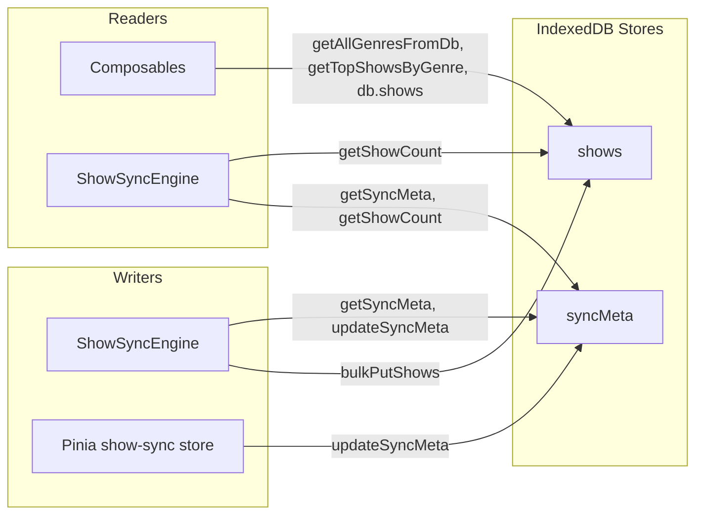

# Database Layer (IndexedDB + Dexie)

**Related:** [ADR-004: IndexedDB Indexes for Sort and Filter](../adr/004-indexeddb-indexes-for-sort-filter.md), [ADR-001: Client-Side IndexedDB Sync](../adr/001-client-side-indexeddb-sync.md), [index.ts](../../src/shared/db/index.ts)

## Summary

The database layer is a thin Dexie-based wrapper over IndexedDB that stores the TV Maze show catalogue and sync progress. The `ShowSyncEngine` writes shows via `bulkPutShows()` and sync metadata via `updateSyncMeta()`; the Pinia sync store and Vue composables read metadata, genre lists, and paginated/sorted show data. Precomputed sort keys (`_ratingSort`, `_premieredSort`) and a multi-entry `*genres` index enable efficient index-backed ordering and genre filtering without loading the full dataset into memory. Index rationale is documented in [ADR-004](../adr/004-indexeddb-indexes-for-sort-filter.md).

## Problem and context

The application has no backend: the bulk catalogue must live in the browser. IndexedDB is the only client-side store that can hold ~80 000 shows (~80 MB) and survive page refreshes. Sorting and filtering must work without loading every record into memory, so the layer exposes indexes (including precomputed sort keys) and uses Dexie’s cursor-based APIs. Sync progress (last page, total pages, completed/paused state) must also persist so the [Show Sync Engine](show-sync-engine.md) can resume after a refresh.

## How it works (high level)

Two object stores exist: `shows` (keyed by show `id`) and `syncMeta` (single record keyed by `SYNC_META_ID`). The sync engine is the only writer for `shows` (via `bulkPutShows`) and the primary updater of `syncMeta` (via `getSyncMeta` / `updateSyncMeta`). Composables and the sync store read through the exported helpers and the shared `db` instance; genre and sort indexes back the query chains described in the [README — IndexedDB Query Pipeline](../../README.md#indexeddb-query-pipeline).

## Schema and stores

The Dexie database `TvMazeDb` defines:

| Store      | Key  | Indexes                                          | Purpose                                                           |
| ---------- | ---- | ------------------------------------------------ | ----------------------------------------------------------------- |
| `shows`    | `id` | `id, name, *genres, _ratingSort, _premieredSort` | Show records with precomputed sort keys; multi-entry genre index. |
| `syncMeta` | `id` | `id`                                             | Single row: sync progress and pause state.                        |

Index semantics (e.g. why `*genres` is multi-entry, how sort keys are used) are described in [ADR-004](../adr/004-indexeddb-indexes-for-sort-filter.md).

### StoredTvmazeShow and toStoredShow

Each API show is stored as `StoredTvmazeShow`: `TvmazeShow` plus `_ratingSort` (numeric) and `_premieredSort` (string). `toStoredShow(show)` sets:

- `_ratingSort = show.rating?.average ?? -1`
- `_premieredSort = show.premiered ?? '1900-01-01'`

So missing rating or premiere date sorts to the end when ordering descending. `bulkPutShows()` maps every incoming show through `toStoredShow()` before `bulkPut`.

### SyncMeta

Single record with `id: SYNC_META_ID` (`'showSync'`). Fields:

| Field                 | Purpose                                                                        |
| --------------------- | ------------------------------------------------------------------------------ |
| `lastCompletedPage`   | Highest page number successfully written by the sync engine.                   |
| `totalShowsStored`    | Total number of shows in the `shows` store (can be read via `getShowCount()`). |
| `estimatedTotalPages` | Total pages (from probe); used for progress and ETA.                           |
| `isCompleted`         | True when sync has finished (empty page or 404).                               |
| `isPaused`            | Persisted pause state so a refresh restores UI state.                          |

`updateSyncMeta(partial)` merges `partial` over the existing row and puts the result; if no row exists, defaults fill missing fields.

## Schema versions

Migrations are declared on the Dexie instance:

1. **v1** — `shows: 'id, name'`, `syncMeta: 'id'`. Initial schema.
2. **v2** — `shows: 'id, name, *genres'`. Multi-entry genre index for genre listing and genre-scoped queries.
3. **v3** — `shows: 'id, name, *genres, _ratingSort, _premieredSort'`. Sort-key indexes plus an upgrade that backfills `_ratingSort` and `_premieredSort` for all existing show records.

See [ADR-004](../adr/004-indexeddb-indexes-for-sort-filter.md) and [index.ts](../../src/shared/db/index.ts) for the exact upgrade logic.

## Consumers

| Consumer                  | Uses                                                                                                                                                                           |
| ------------------------- | ------------------------------------------------------------------------------------------------------------------------------------------------------------------------------ |
| **ShowSyncEngine**        | `getSyncMeta`, `updateSyncMeta`, `bulkPutShows`, `getShowCount`, `SyncMeta` type.                                                                                              |
| **Pinia show-sync store** | `getSyncMeta`, `updateSyncMeta`.                                                                                                                                               |
| **Composables**           | `getAllGenresFromDb`, `getTopShowsByGenre` (genre carousels, genre list); `db` for query chains in `useShowsByGenre` (sort, filter, paginate) and `useShowDetail` (get by id). |

The full query chain (orderBy → reverse → filter → count / offset+limit) is described in the [README — IndexedDB Query Pipeline](../../README.md#indexeddb-query-pipeline).

## API summary (quick reference)

| Export / symbol                            | Description                                                                                  |
| ------------------------------------------ | -------------------------------------------------------------------------------------------- | ----------------- | -------- |
| `db`                                       | Dexie instance (`TvMazeDb`). Use `db.shows` and `db.syncMeta` for query chains.              |
| `SYNC_META_ID`                             | Constant `'showSync'` — key of the single sync-meta record.                                  |
| `getSyncMeta()`                            | Returns the current sync-meta row or `undefined`.                                            |
| `updateSyncMeta(partial)`                  | Merges `partial` into the sync-meta row and puts it; creates row with defaults if missing.   |
| `bulkPutShows(shows)`                      | Maps each show through `toStoredShow()` and bulk-puts into `shows`. No-op if array is empty. |
| `getShowCount()`                           | Returns `db.shows.count()`.                                                                  |
| `getAllGenresFromDb()`                     | Returns sorted unique genre names using the `*genres` index.                                 |
| `getTopShowsByGenre(genre, limit, sortBy)` | Top `limit` shows for `genre` by `sortBy` (default `_ratingSort`), descending.               |
| `toStoredShow(show)`                       | Converts `TvmazeShow` to `StoredTvmazeShow` (adds sort keys).                                |
| `StoredTvmazeShow`                         | Type: `TvmazeShow` plus `_ratingSort`, `_premieredSort`.                                     |
| `SyncMeta`                                 | Type for the sync-meta row.                                                                  |
| `ShowSortKey`                              | Type: `'\_ratingSort'                                                                        | '\_premieredSort' | 'name'`. |

## Related documentation

- [ADR-004: IndexedDB Indexes for Client-Side Sort and Filter](../adr/004-indexeddb-indexes-for-sort-filter.md) — Index design and migration rationale.
- [ADR-001: Client-Side SPA with IndexedDB Background Sync](../adr/001-client-side-indexeddb-sync.md) — Why IndexedDB was chosen.
- [Show Sync Engine](show-sync-engine.md) — Writes shows and sync meta; reads meta and count.
- [README — Architecture](../../README.md#architecture) — High-level data paths.
- [README — IndexedDB Query Pipeline](../../README.md#indexeddb-query-pipeline) — Query chain (orderBy, filter, pagination).
- [index.ts](../../src/shared/db/index.ts) — Source implementation.
