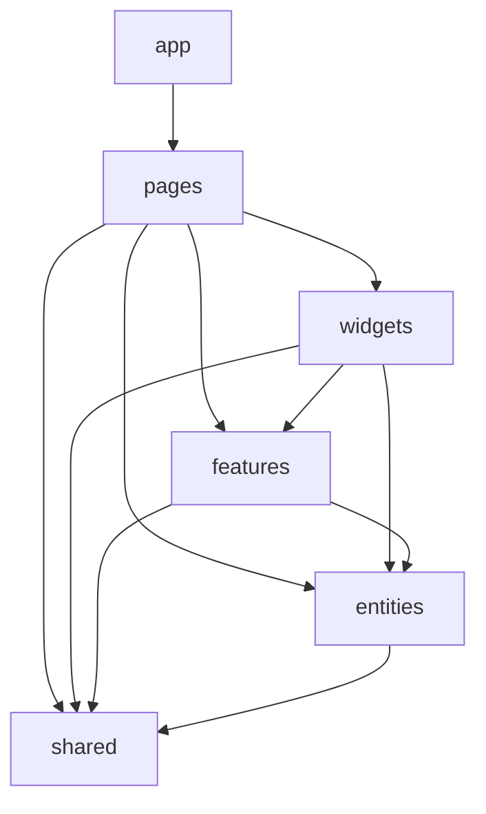

# Feature-Sliced Design Structure

**Related:** [ADR-006: Feature-Sliced Design Architecture](../adr/006-feature-sliced-design-architecture.md)

## Summary

The application is organized using Feature-Sliced Design (FSD). Code is grouped by **business domain and scope** (layers and slices) rather than by technical type. Dependency direction is strict: higher layers may only import from lower layers; slices on the same layer do not import from each other. Each slice exposes a public API via `index.ts`.

## Layers (top to bottom)

| Layer     | Purpose | Slices? |
| --------- | ------- | ------- |
| **app**   | Global bootstrap: router, styles, providers, entry composition. | No — segments only. |
| **pages** | Route-level compositions. Thin assembly of widgets, features, and entities. | Yes — one slice per route (e.g. `home`, `search`, `show-detail`). |
| **widgets** | Large self-contained UI blocks that deliver a full use case or section. | Yes — e.g. `app-layout`, `show-sync-dashboard`, `genre-carousels`. |
| **features** | User interactions and business use cases (actions that bring value). | Yes — e.g. `show-sync`, `theme`. |
| **entities** | Core business domain models the app works with. | Yes — e.g. `show`, `genre`, `episode`, `person`. |
| **shared** | Domain-agnostic, reusable code (UI primitives, API client, DB, lib, config). | No — segments only. |

**Dependency rule:** A module in layer L may only import from layers **strictly below** L. Same-layer slices must not import from each other. `shared` is never a consumer; it is only depended upon.

## Segments (within a slice or app/shared)

Segments group code by technical purpose. Conventional names:

| Segment | Purpose |
| ------- | ------- |
| `ui` | UI components, templates, and presentational logic. |
| `model` | Data model: types, stores, composables, business logic. |
| `api` | Backend/API calls, request functions, mappers. |
| `lib` | Small helpers used only within this slice. |
| `config` | Configuration and feature flags. |

Not every slice has every segment; use only what is needed. The **app** and **shared** layers have no slices and are divided directly into segments (e.g. `app/router/`, `app/styles/`, `shared/ui/`, `shared/api/`, `shared/lib/`).

## Public API (index.ts)

Each slice exposes a public API via an `index.ts` file at the slice root. Only symbols exported from this file may be imported by other layers. Internal files (e.g. `model/engine.ts`) must not be imported from outside the slice; consumers use the slice’s public API (e.g. `import { useShowSyncStore } from '@/features/show-sync'`).

Benefits:

- Refactors inside a slice do not force changes in consumers as long as the public API is stable.
- Dependency direction is visible: you see exactly what a slice exposes.

## Import rules (summary)

1. **Direction** — Imports only from layers **below** the current layer. No importing from the same layer (except within the same slice) or from above.
2. **Public API** — Imports from another slice or layer use only that slice’s/layer’s public entry (e.g. `@/entities/show`, `@/shared/ui`), not deep paths into internal files (e.g. avoid `@/entities/show/model/use-show-detail` unless that is the documented public API).
3. **Path alias** — The project uses `@/` for `src/`, so imports look like `@/shared/lib/utils`, `@/entities/show`, `@/features/theme`.

## File mapping (old → new)

After migration, the following mapping applies. Tests move with their source (e.g. `components/__tests__/ShowCard.spec.ts` → `entities/show/ui/__tests__/ShowCard.spec.ts`).

### app

| Old path | New path |
| -------- | -------- |
| `src/router/index.ts` | `src/app/router/index.ts` |
| `src/style.css` | `src/app/styles/index.css` |
| `src/App.vue` | `src/App.vue` (or `src/app/App.vue` — see migration) |
| `src/main.ts` | `src/main.ts` (Vite entrypoint unchanged) |

### pages

| Old path | New path |
| -------- | -------- |
| `src/views/HomeView.vue` | `src/pages/home/ui/HomePage.vue` |
| `src/views/SearchView.vue` | `src/pages/search/ui/SearchPage.vue` |
| `src/views/GenresView.vue` | `src/pages/genres/ui/GenresPage.vue` |
| `src/views/GenreView.vue` | `src/pages/genre/ui/GenrePage.vue` |
| `src/views/ShowDetailView.vue` | `src/pages/show-detail/ui/ShowDetailPage.vue` |

### widgets

| Old path | New path |
| -------- | -------- |
| `src/components/layout/AppLayout.vue` | `src/widgets/app-layout/ui/AppLayout.vue` |
| `src/components/layout/AppHeader.vue` | `src/widgets/app-layout/ui/AppHeader.vue` |
| `src/components/layout/AppFooter.vue` | `src/widgets/app-layout/ui/AppFooter.vue` |
| `src/components/ShowSyncDashboard.vue` | `src/widgets/show-sync-dashboard/ui/ShowSyncDashboard.vue` |
| `src/components/HomeGallerySkeleton.vue` | `src/widgets/genre-carousels/ui/HomeGallerySkeleton.vue` |
| `src/components/GenreCarousel.vue` (from entities) | `src/widgets/genre-carousels/ui/GenreCarousel.vue` |
| `src/composables/use-genre-carousels.ts` | `src/widgets/genre-carousels/model/use-genre-carousels.ts` |

### features

| Old path | New path |
| -------- | -------- |
| `src/stores/show-sync.ts` | `src/features/show-sync/model/store.ts` |
| `src/services/show-sync-engine.ts` | `src/features/show-sync/model/engine.ts` |
| `src/services/rate-limiter.ts` | `src/features/show-sync/model/rate-limiter.ts` |
| `src/components/layout/SyncStatusBadge.vue` | `src/features/show-sync/ui/SyncStatusBadge.vue` |
| `src/composables/use-theme.ts` | `src/features/theme/model/use-theme.ts` |
| `src/components/layout/ThemeToggle.vue` | `src/features/theme/ui/ThemeToggle.vue` |

### entities

| Old path | New path |
| -------- | -------- |
| `src/types/show.ts` + `src/types/common.ts` | `src/entities/show/model/types.ts` (merged as needed) |
| `src/types/episode.ts` | `src/entities/episode/model/types.ts` |
| `src/types/person.ts` + `src/types/season.ts` | `src/entities/person/model/types.ts` (merged as needed) |
| `src/types/index.ts` | Removed; re-exported from each entity’s public API |
| `src/composables/use-show-detail.ts` | `src/entities/show/model/use-show-detail.ts` |
| `src/composables/use-shows-by-genre.ts` | `src/entities/show/model/use-shows-by-genre.ts` |
| `src/composables/use-all-genres.ts` | `src/entities/genre/model/use-all-genres.ts` |
| `src/components/ShowCard.vue` | `src/entities/show/ui/ShowCard.vue` |
| `src/components/ShowCardSkeleton.vue` | `src/entities/show/ui/ShowCardSkeleton.vue` |
| `src/components/ShowDetailSkeleton.vue` | `src/entities/show/ui/ShowDetailSkeleton.vue` |
| `src/components/ShowGrid.vue` | `src/entities/show/ui/ShowGrid.vue` |
| `src/components/GenreCard.vue` | `src/entities/genre/ui/GenreCard.vue` |
| `src/components/GenreCarousel.vue` | `src/widgets/genre-carousels/ui/GenreCarousel.vue` |
| `src/components/EpisodeCard.vue` | `src/entities/episode/ui/EpisodeCard.vue` |
| `src/components/PersonAvatar.vue` | `src/entities/person/ui/PersonAvatar.vue` |

### shared

| Old path | New path |
| -------- | -------- |
| `src/lib/*` | `src/shared/lib/*` |
| `src/config.ts` | `src/shared/config/index.ts` |
| `src/db/*` | `src/shared/db/*` |
| `src/services/api-client.ts` | `src/shared/api/api-client.ts` |
| `src/services/tvmaze.ts` | `src/shared/api/tvmaze.ts` |
| `src/components/ui/*` | `src/shared/ui/*` (all shadcn primitives) |

Consumers import from the shared layer public API (e.g. `@/shared/api` for `getShow`, `getShows`, `ApiError`).

## Tests

Unit and integration tests live next to their source under `__tests__/` (e.g. `entities/show/ui/__tests__/ShowCard.spec.ts`). Test utilities remain at `src/test-utils.ts` (or `src/shared/lib/test-utils.ts` if moved during cleanup). Imports in tests use the same `@/` paths as application code.

## Tooling

- **Steiger** — FSD linter to enforce layer boundaries and public API usage. Configured in `steiger.config.ts` and run as part of `npm run lint`.

## Related documentation

- [ADR-006: Feature-Sliced Design Architecture](../adr/006-feature-sliced-design-architecture.md) — Decision and rationale.
- [Database Layer](database-layer.md) — IndexedDB/Dexie layer (lives under `shared/db`).
- [Show Sync Engine](show-sync-engine.md) — Sync engine (lives under `features/show-sync/model`).
