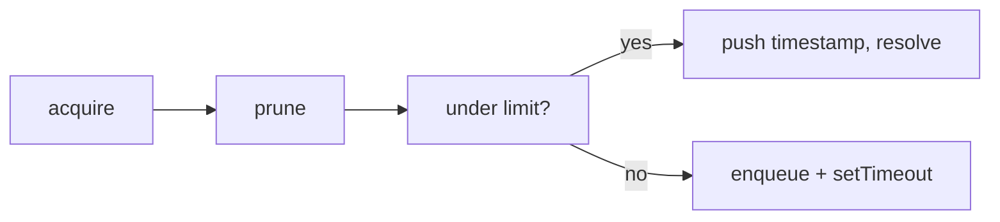

# Rate Limiter (Sliding Window)

**Related:** [ADR-003: Background Sync Engine](../adr/003-background-sync-engine.md), [rate-limiter.ts](../../src/features/show-sync/model/rate-limiter.ts)

## Summary

The `RateLimiter` class enforces a sliding-window limit on the number of requests allowed in a time window. It is used by the `ShowSyncEngine` before each TV Maze API call to stay within the API limit (20 requests per 10 seconds). Callers use `acquire()` before making a request; the returned Promise resolves when a slot is available. At most `maxRequests` requests are counted within the last `windowMs` milliseconds.

## Problem and constraints

The TV Maze API allows a maximum of 20 requests per 10 seconds. Exceeding this limit returns HTTP 429. The rate limiter ensures the client never sends more than N requests in the last W ms. It uses a **sliding window**: only requests in the last W ms count, unlike a fixed-window scheme where the window resets at fixed clock boundaries. Sliding windows avoid bursts at window boundaries and give a smoother, more accurate limit.

## How it works (high level)

Callers invoke `acquire()` before each API request. If the number of recent requests (within the window) is below the maximum, the Promise resolves immediately and a slot is recorded. If at capacity, the caller is queued and will be woken when a slot frees up (when the oldest request exits the window).



## Concepts

### Sliding window

The window is "the last W ms from now." Only request timestamps inside that window count toward the limit. As time moves forward, older timestamps fall outside the window and are removed by `#prune()`.

```
TIME ───────────────────────────────────────────────────────────►

         windowMs ago                    NOW
              │                           │
              ▼                           ▼
    ──────────┼───────────────────────────┼──────────
              │◄────── WINDOW ───────────►│
              │   (only these count)      │
              │                           │
    Old requests (ignored)    Recent requests (count toward limit)
```

`#prune()` keeps only timestamps newer than `Date.now() - windowMs`:

```ts
const cutoff = Date.now() - this.#windowMs
this.#timestamps = this.#timestamps.filter((t) => t > cutoff)
```

### Data structures

| Field / concept | Purpose                                                                                               |
| --------------- | ----------------------------------------------------------------------------------------------------- |
| `#timestamps`   | Array of timestamps of requests that currently count toward the limit (requests "inside" the window). |
| `#waitQueue`    | Queue of callbacks for callers waiting for a slot. Processed in FIFO order when slots free up.        |
| `#windowMs`     | Window size in milliseconds (e.g. 10_000). Only timestamps within the last `#windowMs` ms count.      |
| `#maxRequests`  | Maximum number of requests allowed in the window (e.g. 20).                                           |
| `#disposed`     | When true, no new slots are granted and pending waiters are rejected.                                 |

## Control flow

### acquire()

1. If `#disposed`, reject immediately.
2. Call `#prune()` to drop timestamps outside the window.
3. If `#timestamps.length < #maxRequests`: push `Date.now()` onto `#timestamps`, resolve the Promise, then call `#processQueue()` to serve the next waiter if any.
4. If at capacity: compute `waitMs = windowMs - (now - oldest)` (time until the oldest timestamp exits the window), push a callback onto `#waitQueue` that will call `run()` again (so the caller retries), and schedule `#processQueue()` with `setTimeout(..., waitMs)`.

When the timer fires, `#processQueue()` runs; after pruning, a slot may be free and the next queued callback is invoked, which calls `run()` again and either gets a slot or re-enqueues.

### #processQueue()

1. Call `#prune()` to update the window.
2. While `#waitQueue` is non-empty and `#timestamps.length < #maxRequests`: shift the next callback and invoke it. Each callback, when run, will push a timestamp and resolve, so the loop continues until the queue is empty or the limit is reached again.

### dispose()

Set `#disposed = true`, then invoke every callback in `#waitQueue` (each will see `#disposed` and reject). Clear `#waitQueue`. Call when tearing down the sync engine so no promises hang.

## Wait time and scheduling

When at capacity, the next slot will free up when the **oldest** request in the window expires, i.e. at time `oldest + windowMs`. So the wait time from now is:

```
waitMs = windowMs - (Date.now() - oldest)
```

A single `setTimeout` is scheduled for that duration; when it fires, `#processQueue()` runs, prunes (dropping the oldest timestamp), and serves the next waiter. This avoids busy polling and wakes exactly when a slot is expected to be available.

## Example scenario

Example: `maxRequests = 2`, `windowMs = 1000`.

- **t=0 ms:** Request A calls `acquire()`. `#timestamps` is empty → A gets a slot, `#timestamps = [0]`, A's Promise resolves.
- **t=100 ms:** Request B calls `acquire()`. One timestamp in window → B gets a slot, `#timestamps = [0, 100]`, B's Promise resolves.
- **t=200 ms:** Request C calls `acquire()`. Two timestamps → at capacity. C is queued. Oldest = 0, so `waitMs = 1000 - 200 = 800` ms. `setTimeout(#processQueue, 800)`.
- **t=1000 ms:** Timer fires. `#prune()`: cutoff = 0, so timestamp 0 is dropped, `#timestamps = [100]`. One slot free. C's callback runs; C gets a slot, `#timestamps = [100, 1000]`, C's Promise resolves.

So C waits until the oldest request (at 0) has left the 1 s window, then proceeds.

## API summary (quick reference)

| Method / constructor                                 | Description                                                                                                                               |
| ---------------------------------------------------- | ----------------------------------------------------------------------------------------------------------------------------------------- |
| `constructor(maxRequests: number, windowMs: number)` | Create a limiter allowing at most `maxRequests` in the last `windowMs` ms.                                                                |
| `acquire(): Promise<void>`                           | Returns a Promise that resolves when a request slot is available. Call before each API request. Rejects if the limiter has been disposed. |
| `dispose(): void`                                    | Marks the limiter as disposed, rejects any pending waiters, and clears the queue. Call when tearing down the sync engine.                 |

## Related documentation

- [ADR-003: Background Sync Engine with Pause/Resume](../adr/003-background-sync-engine.md) — Decision and context for the sync engine and rate limiter.
- [README — Architecture](../../README.md#architecture) — High-level application architecture.
- [rate-limiter.ts](../../src/features/show-sync/model/rate-limiter.ts) — Source implementation.
