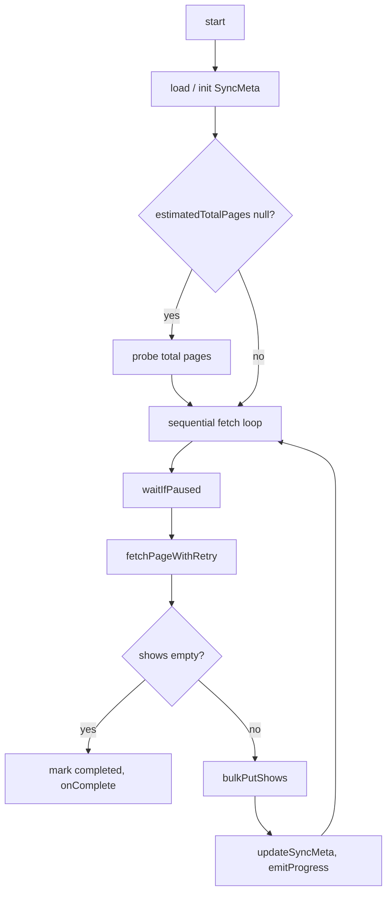

# Show Sync Engine

**Related:** [ADR-003: Background Sync Engine](../adr/003-background-sync-engine.md), [Rate limiter (architecture)](rate-limiter.md), [show-sync-engine.ts](../../src/services/show-sync-engine.ts)

## Summary

The `ShowSyncEngine` is a pure TypeScript class that paginates the TV Maze `/shows` endpoint, respects the API rate limit via a sliding-window [RateLimiter](rate-limiter.md), and persists each page into IndexedDB. The Pinia store (`useShowSyncStore`) wraps the engine and exposes reactive state to the UI. The engine supports pause/resume, progress persistence across page refreshes, and non-blocking operation: the sync runs in the same thread but yields via `await`, so the user can browse, search, and sort while sync runs.

## Problem and context

The application must download roughly 80 000 shows from the TV Maze API (paginated at ~250 shows per page, ~361 pages). The API enforces a rate limit of 20 requests per 10 seconds. The sync must not block the user from interacting with the app, and progress must survive page refreshes so returning users can resume or see completed state.

## How it works (high level)

On `start()`, the engine loads or initializes sync metadata from IndexedDB. If the total number of pages is unknown, it runs a binary-search probe to estimate it. Then it enters a sequential fetch loop: for each page it waits for a rate-limit slot, fetches the page (with retries for 429 and transient errors), writes shows to IndexedDB, updates metadata, and emits progress. When a page returns empty (or 404), the engine marks sync as completed and calls `onComplete()`. Pause/resume and dispose are supported via internal flags and the rate limiter.

## Sync lifecycle

### Initialization

On `start()`, the engine calls `getSyncMeta()` and `getShowCount()`. If no meta exists, it calls `updateSyncMeta()` with initial values: `lastCompletedPage`, `totalShowsStored` (from `getShowCount()`), `estimatedTotalPages: null`, `isCompleted: false`, `isPaused: false`. It then re-reads meta so the rest of the run uses a consistent object.

### Page probing

When `meta.estimatedTotalPages == null`, the engine calls `#probeTotalPages(lastCompleted)` to estimate the total number of pages. The result is persisted via `updateSyncMeta({ estimatedTotalPages })` so the main loop can compute progress and ETA.

**Algorithm.** `#probeTotalPages(lastCompleted)` sets `low = lastCompleted + 1` and `high = lastCompleted + PROBE_UPPER_OFFSET` (500). While `low < high` and not `#stopped`:

1. Calls `#waitIfPaused()`.
2. Computes `mid = (low + high) >> 1`.
3. Acquires a rate-limit slot and calls `getShows(mid)`.
4. On 429: sleep with initial backoff, continue.
5. On 404: set `high = mid` (page is out of range).
6. On empty array: set `high = mid`.
7. Otherwise: set `low = mid + 1`.
8. On other errors: throw.

Returns `low` (the estimated total number of pages). TV Maze returns 404 for out-of-range pages instead of an empty array; both 404 and empty are used to narrow the upper bound.

**Example scenario.** First sync, no meta yet: `lastCompleted = -1`. So `low = 0`, `high = 499`. The probe searches `[0, 499]` for the first page that returns 404 or empty. TV Maze has about 361 pages (0-based 0..360), so the goal is `estimatedTotalPages = 361`.

| Step | low | high | mid | getShows(mid) | Action |
|------|-----|------|-----|---------------|--------|
| 1    | 0   | 499  | 249 | data          | Page 249 exists → `low = 250` |
| 2    | 250 | 499  | 374 | 404           | Out of range → `high = 374` |
| 3    | 250 | 374  | 312 | data          | → `low = 313` |
| 4    | 313 | 374  | 343 | data          | → `low = 344` |
| 5    | 344 | 374  | 359 | data          | → `low = 360` |
| 6    | 360 | 374  | 367 | 404           | → `high = 367` |
| 7    | 360 | 367  | 363 | 404           | → `high = 363` |
| 8    | 360 | 363  | 361 | 404           | → `high = 361` |
| 9    | 360 | 361  | 360 | data          | Last valid page → `low = 361` |
| 10   | 361 | 361  | —   | —             | `low < high` false → return `361` |

The probe makes about 9 API calls instead of 361. If sync had already completed some pages (e.g. `lastCompleted = 100`), the probe would run over `[101, 600]` with the same logic.

### Sequential fetch

The main loop starts at `page = lastCompleted + 1`. Each iteration:

1. Calls `#waitIfPaused()` (polls every 100 ms while paused).
2. If `#stopped`, exits.
3. Calls `#fetchPageWithRetry(page)` (which uses `rateLimiter.acquire()` then `getShows(page)` with retry logic).
4. If the fetch throws, calls `onError(message)` and returns.
5. If the returned array is empty, writes final meta (`isCompleted: true`, etc.), calls `onComplete()`, and returns.
6. Otherwise calls `bulkPutShows(shows)`. On IndexedDB failure, calls `onError(...)` and returns.
7. Updates meta with `lastCompletedPage`, `totalShowsStored`, then `#recordPageTime()`, `#emitProgress(meta, page)`, and increments `page`.

### Completion

When a page returns an empty array (or is treated as end-of-data via 404), the engine updates `syncMeta` with `isCompleted: true`, `isPaused: false`, and the final page/count, then calls `onComplete()`.

## Data and persistence

Sync metadata is stored in IndexedDB and read/written via `getSyncMeta()` and `updateSyncMeta()` from the db layer.

| Field                  | Purpose |
| ---------------------- | ------- |
| `lastCompletedPage`    | Highest page number successfully fetched and written. |
| `totalShowsStored`     | Total number of shows in IndexedDB. |
| `estimatedTotalPages`  | Total number of pages (from probe); used for progress and ETA. |
| `isCompleted`          | True when sync has finished (empty page or 404). |
| `isPaused`             | Persisted by the store so a refresh restores paused state; the engine itself only uses an in-memory `#paused` flag during a run. |

## Fetch and retry

`#fetchPageWithRetry(page)` obtains a rate-limit slot via `rateLimiter.acquire()`, then calls `getShows(page)`. Error handling:

| Error                           | Strategy |
| ------------------------------- | -------- |
| **HTTP 429** (rate limited)     | Exponential backoff starting at 2 s, doubling up to 30 s max. Retries indefinitely (no finite count). |
| **HTTP 404**                    | Treated as end of data: return `[]`. |
| **HTTP 4xx** (non-404, non-429) | Throw immediately — client-side bug. |
| **HTTP 5xx / network errors**   | Retry up to 5 times with backoff 1 s, 2 s, 4 s, 8 s, 16 s. If all retries fail, throw (caller calls `onError()`). |
| **IndexedDB write failure**      | Not retried; main loop catches and calls `onError()`. |

For 429, the engine sleeps with `backoff429Ms`, then doubles it (capped at 30 s) and continues the loop. For transient errors, it runs an inner retry loop with the fixed backoff schedule; each retry acquires a rate-limit slot again before calling `getShows(page)`.

## Pause and resume

- `#paused` is an in-memory flag. `pause()` sets it to `true`; `resume()` sets it to `false`.
- The main loop and the probe call `#waitIfPaused()`, which runs `while (this.#paused && !this.#stopped) { await sleep(100) }`. So the loop blocks until resumed (or stopped).
- The paused state is persisted to `syncMeta.isPaused` by the Pinia store so a browser refresh can restore "paused" in the UI; the engine itself only reads/writes meta at start and during the fetch loop.

## ETA and progress

- The engine keeps the last `ETA_WINDOW_SIZE` (20) page-completion timestamps in `#pageTimestamps`. After each successful page, `#recordPageTime()` pushes `Date.now()` and drops the oldest if the array exceeds 20.
- `#getPagesPerSecond()`: if there are at least 2 timestamps, returns `(length - 1) / (newest - oldest)` in ms, converted to per-second (×1000). Otherwise 0.
- `#getEstimatedTimeRemainingMs(remainingPages)`: if at least 2 timestamps and `remainingPages > 0`, computes `msPerPage = span / (length - 1)` and returns `remainingPages * msPerPage` (rounded). Otherwise `null`.
- `#emitProgress(meta, currentPage)` computes remaining pages from `estimatedTotalPages` and `lastCompletedPage`, then calls `onProgress` with `currentPage`, `lastCompletedPage`, `totalShowsStored`, `estimatedTotalPages`, `pagesPerSecond`, and `estimatedTimeRemainingMs`.

## Dispose and teardown

`dispose()` sets `#stopped = true`, sets `#paused = false`, and calls `rateLimiter.dispose()`. The main loop and `#fetchPageWithRetry` check `#stopped` and exit or throw so the engine stops cleanly. The rate limiter’s `dispose()` rejects any pending `acquire()` promises so no callers hang.

## API summary (quick reference)

| Method / constructor | Description |
| -------------------- | ----------- |
| `constructor(callbacks: ShowSyncEngineCallbacks)` | Creates the engine with `onProgress`, `onComplete`, and `onError` callbacks. |
| `start(): Promise<void>` | Loads/initializes meta, probes total pages if needed, then runs the sequential fetch loop. Resolves when the loop exits (complete, error, or stopped). |
| `pause(): void`        | Sets internal paused flag; loop blocks in `#waitIfPaused()`. |
| `resume(): void`       | Clears paused flag; loop continues. |
| `dispose(): void`      | Stops the engine and disposes the rate limiter. |

**Callbacks:**

| Callback        | When |
| --------------- | ---- |
| `onProgress(p)` | After each page is written; `p` includes `currentPage`, `lastCompletedPage`, `totalShowsStored`, `estimatedTotalPages`, `pagesPerSecond`, `estimatedTimeRemainingMs`. |
| `onComplete()`  | When sync finishes (empty page or 404). |
| `onError(msg)`  | On unrecoverable fetch error or IndexedDB write failure. |

## Related documentation

- [ADR-003: Background Sync Engine with Pause/Resume](../adr/003-background-sync-engine.md) — Decision and context.
- [Rate limiter (architecture)](rate-limiter.md) — How the rate limiter works.
- [README — Architecture](../../README.md#architecture) — High-level application architecture.
- [show-sync-engine.ts](../../src/services/show-sync-engine.ts) — Source implementation.
